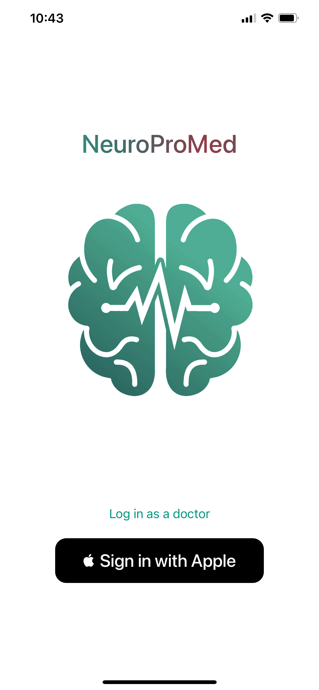
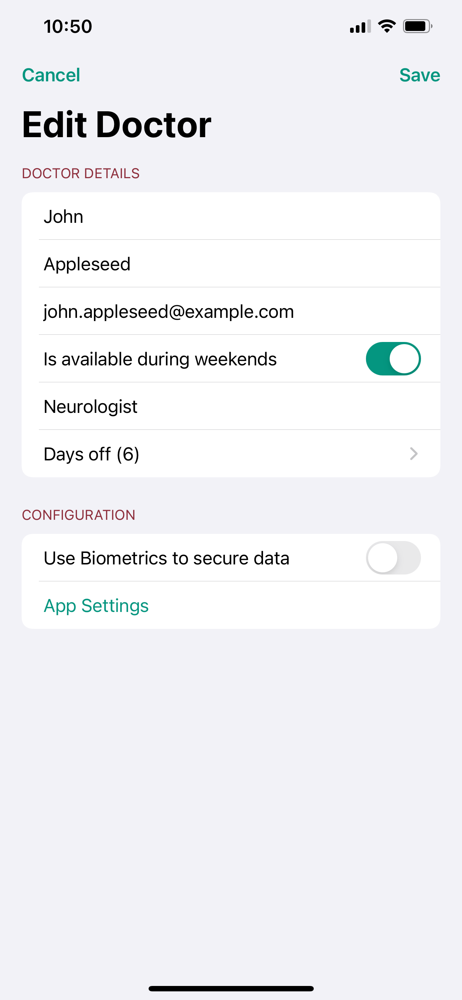
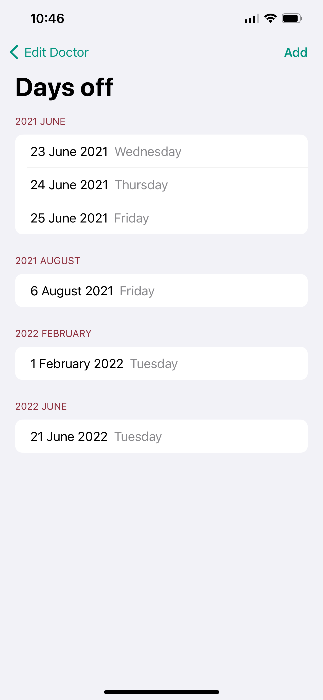
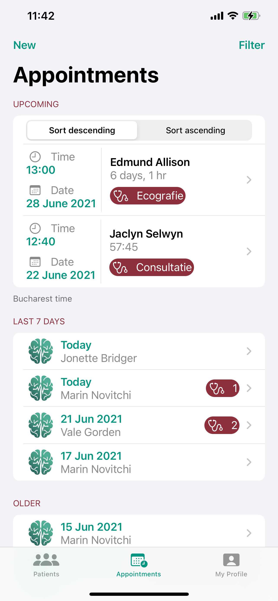
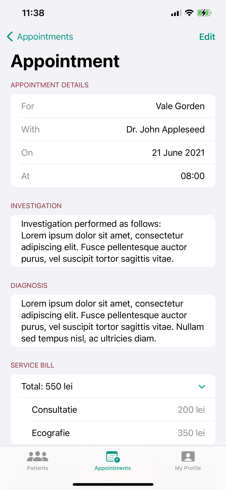
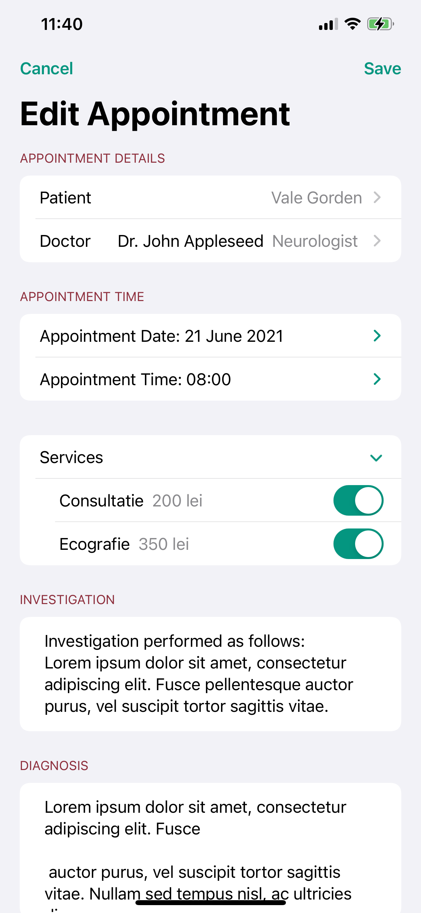
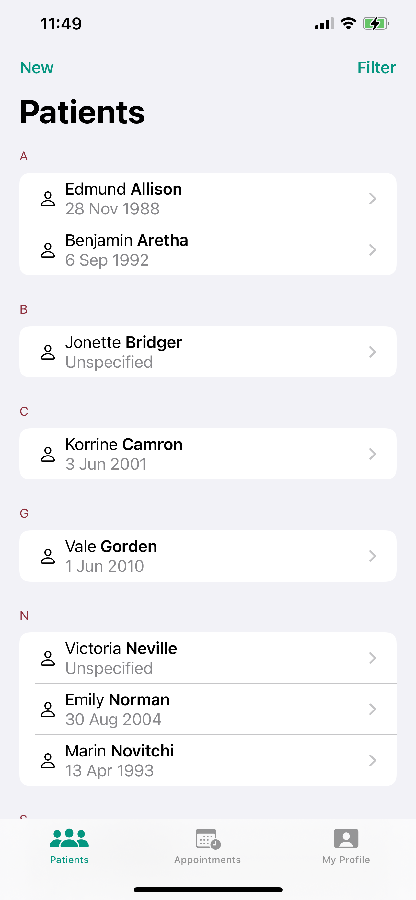
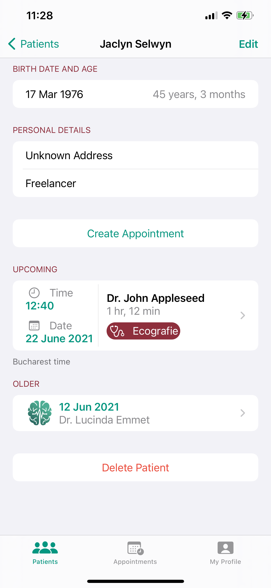
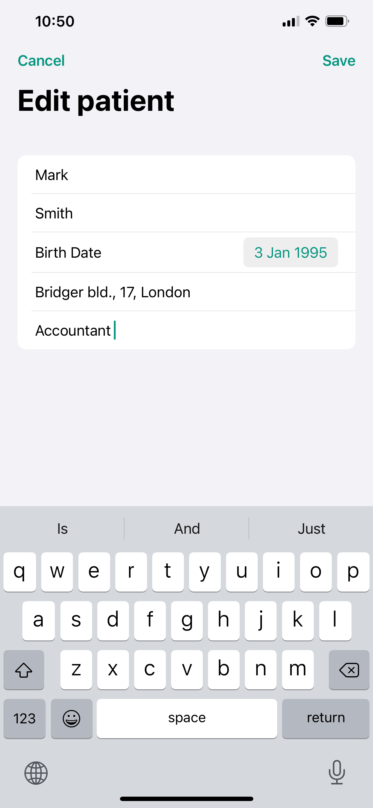

# NeuroProMed
Native iOS application used for managing medical services (e.g. for a private clinic).
The application allows users to create an account, book doctor appointments and view appointment history.
Moreover, doctors and medical personnel are able to manage their availability, patients database, book and manage appointments on behalf of patients.

## Description
When opening the application for the first time the Login View is presented.
The user can create a patient account using Sign in with Apple
For doctors, an additional button is present which, once tapped, provides an additional field for the doctor's ID to be used to log in with advanced priviledges.

The application has two main tabs: 'Appointments' and 'Profile' (plus one an additional 'Patients' tab if user is logged as a doctor).
From the 'Appointments' tab the user is able to create a new appointment or view their history of appointments ordered by date. 
By accessing an element of the list, the user can view additional details such as the exact time of the appointment, 
the doctor for which the appointment is scheduled, the services provided as part of that appointment as well as the the result of the past appointments:
performed investigations and the established diagnosis.
Furthermore, the list of appointments is filterable by each appointment field.

In the Profile tab the user is able to view and edit their personal details and configuration. 
Patients can edit their name, birth date, address and professionnal activity, 
whilst doctors can modify their email, specialty, the availability during weekends and the days where they are not on holiday.
The app also allows to block the access to its data using a biometrics authentication (FaceID or TouchID at the time of writing).

If the user is logged as a doctor, an additional tab 'Patient' is available where the list of patients is displayed. 
The doctor is able to create a new patient, filter the existing list by name, birth date, address and job, or access the existing patients to see their personal details
and appointment history.

## Features
The app is written entirely in Swift and SwiftUI
Its main features are:
- Sign In with Apple capabilities
- Integration with Keychain
- Biometrics authentication
- Integration with calendar
- Local Notifications
- App localization

## Screenshots

## Requirements
The app runs on iPhone devices with iOS version 13 or up.
To build and run the app the bundle identifier and profile must be edited. 
Furthermore, the ApiHandler.baseURL string must be changed to a correct app server URL.

## Credit and mentions
During the implementation of this app the following sources were consulted:
- [Hacking with Swift](https://www.hackingwithswift.com/quick-start/swiftui) **Paul Hudson**'s numerous tutorials and examples

- [Add Event to Calendar iOS Tutorial](https://www.ioscreator.com/tutorials/add-event-calendar-ios-tutorial) article by Arthur Knopper
- [App localization Tips with Swift](https://medium.com/@marcosantadev/app-localization-tips-with-swift-4e9b2d9672c9) article by Marco Santarossa
- [Animating gradients in SwiftUI](https://nerdyak.tech/development/2019/09/30/animating-gradients-swiftui.html) article by Pavel Zak
- [Gradient as foreground color of Text in SwiftUI](https://stackoverflow.com/questions/58991311/gradient-as-foreground-color-of-text-in-swiftui)Rohit Makwana's answer
- [SwiftUI - Open a specific View when user opens a Push Notification](https://stackoverflow.com/questions/66283978/swiftui-open-a-specific-view-when-user-opens-a-push-notification) jnpdx's answer

## Upcoming changes and improvements
- Update code for SwiftUI 3
- Create UI tests
- Create App Clips
- Add custom icons for all services
- Create a statistics/evolution tab based on the information from all the patients appointments
- Eliminate existing hardcoded values such as appointment timeslots, opening hours and currency

## Licence
Distributed under the BSD 2-Clause License. See [LICENSE](https://github.com/MarinNovitchi/NeuroProMed/blob/27c8967f19e9027d61cbe54cfb784d8acbcc8b84/LICENSE) for more information.
